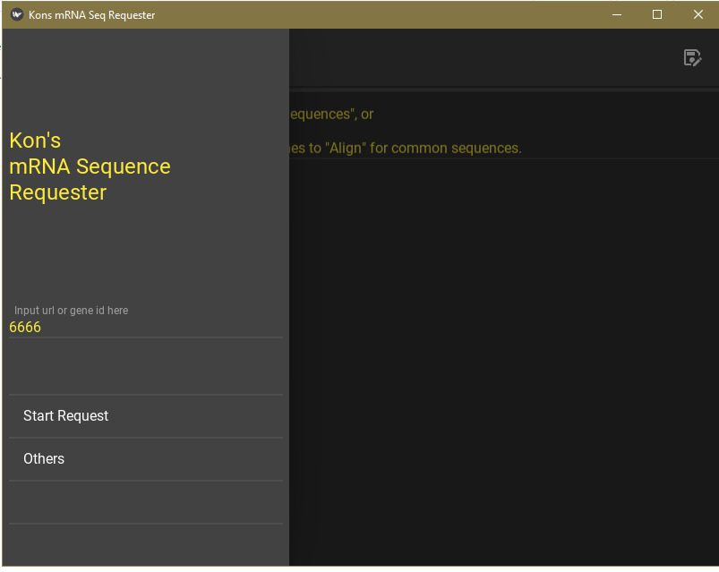
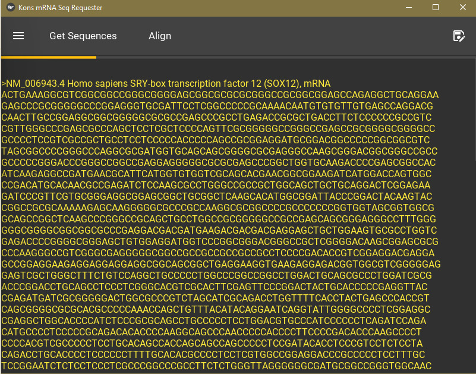

# mRNA sequence requester
This little app retrieves Accession ID and mRNA sequence of a gene from ncbi.nlm.nih.gov and store them in a local text file.   

It can also align the sequences to find common parts, convenient for designing primers (to detect a gene of multiple variants).

